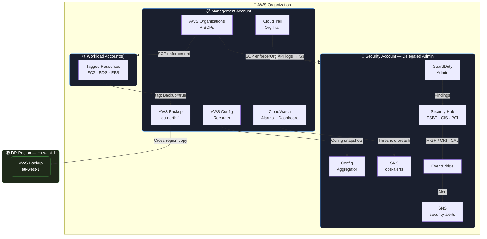

# Forteca-AWS: Multi-Account AWS Secure Landing Zone

   

Forteca-AWS is a secure, multi-account AWS Landing Zone designed to meet **ISO 27001** compliance requirements. It uses Terraform to provision and manage a centralized security operations center, complete with automated backups, organizational structure, compliance auditing, and continuous real-time monitoring.

## Architecture 

The multi-account architecture isolates environments to reduce blast radius and provide separation of duties, a core tenet of ISO 27001.



## Features

- **Multi-Account Strategy**: Leverages AWS Organizations to manage `Management`, `Security`, and `Workload` accounts.
- **Continuous Compliance (AWS Config)**: Implements ISO 27001 managed rules across all accounts (S3 encryption, IAM MFA enforcement, root account monitoring).
- **Threat Detection (Amazon GuardDuty)**: Intelligent threat detection delegated to the Security account.
- **Security Posture Management (AWS Security Hub)**: Centralized view of security alerts automatically routed to SNS/Email via EventBridge.
- **Immutable Audit Trail (CloudTrail)**: Organization trail with file integrity validation (ISO 27001) stored in a restricted S3 bucket.
- **Resilient Automation (AWS Backup)**: Policies enforce regular backups with cross-region replication and Vault Lock (WORM) ensuring immutability against accidental deletion or ransomware.
- **Real-Time Operational Alarms**: CloudWatch metrics trigger notifications for high-priority events (e.g., Root account login, failed backups, trail modifications).

## Prerequisites

1. An AWS Management account.
2. An AWS IAM User or Role with `AdministratorAccess` in the Management account.
3. [Terraform CLI](https://developer.hashicorp.com/terraform/install) **~> 1.6** installed.
4. AWS CLI configured with credentials for the Management account.

## Deployment Instructions

1. **Clone the repository:**
   ```bash
   git clone <repository_url>
   cd aws-sab/terraform
   ```

2. **Setup the Configuration:**
   Copy the example variables file and adjust the values:
   ```bash
   cp envs/management/terraform.tfvars.example envs/management/terraform.tfvars
   ```
   Open `terraform.tfvars` and edit the configurations, specifically:
   - `aws_account_id` and `security_account_id`
   - `alert_email` and `ops_alert_email`
   - `member_accounts` mapping block

3. **Initialize Terraform:**
   ```bash
   cd envs/management
   terraform init
   ```

4. **Review the Execution Plan:**
   ```bash
   terraform plan
   ```

5. **Apply the Changes:**
   ```bash
   terraform apply
   ```

6. **Confirm SNS Subscriptions:**
   Check the inboxes of both `alert_email` and `ops_alert_email` to confirm the AWS SNS topic subscriptions. Alerts will not be delivered until they are confirmed.

## Project Customization

By changing the `project_name` variable in `terraform.tfvars`, all spawned resources (S3 buckets, KMS aliases, backup vaults, etc.) will dynamically adapt prefixes to seamlessly provision new isolated environments.

## Modules Overview

- **organizations**: Bootstraps the AWS organization, organizational units (OUs), and provisions member accounts.
- **cloudtrail**: Creates org-wide continuous auditing trails delivered to secured S3 buckets.
- **security**: Implements Config Rules, GuardDuty, and Security Hub integrations and delegates administrative tasks to the Security account.
- **backup**: Defines automated backup schedules, cross-region replication for disaster recovery, and sets up immutable vault locks.
- **alerting**: Sets up notifications (SNS), CloudWatch metrics/alarms, and unified dashboards.

## Compliance

For a detailed mapping of AWS controls to ISO/IEC 27001:2022 clauses, see [COMPLIANCE.md](./COMPLIANCE.md).

## License

This project is licensed under the **MIT License** — see [LICENSE](./LICENSE) for full details.
